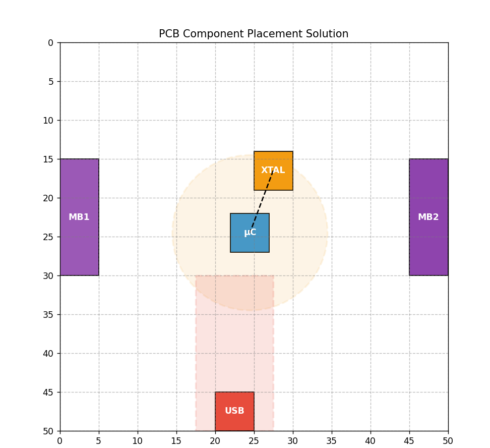

# 📐 PCB Component Placement System

## 📌 Overview
This project implements a **2D rectangular packing algorithm** to place PCB components on a 50×50 unit board.  
The algorithm ensures that all **hard constraints** are satisfied while also optimizing layout compactness and centrality.

---

## 🛠 Components
- **USB Connector (5×5)** → must be placed on a board edge  
- **Microcontroller (5×5)** → can be placed anywhere  
- **Crystal (5×5)** → must be within 10 units of the Microcontroller  
- **MikroBus Connector 1 (5×15)** → must be placed on a board edge  
- **MikroBus Connector 2 (5×15)** → must be placed on the opposite edge, parallel to MB1  

---

## ✅ Hard Constraints
- Edge placement for USB, MB1, and MB2  
- MB1 and MB2 must be parallel and on opposite edges  
- Crystal within 10 units of Microcontroller  
- No overlapping of components  
- All components within board boundaries  
- Global balance: Center of Mass within 2 units of board center (25,25)  
- Keep-out zone: Crystal–Microcontroller path must avoid USB interference  

---

## 🎯 Soft Constraints
- Minimize wasted space  
- Maximize compactness  
- Prefer central placement  

---

## 📂 Project Structure
placement_assignment/

│── src/

│ ├── placement_solver.py # Algorithm implementation

│ ├── Test_placement_solver_ver2.py # Provided validation script

│ └── my_valid_submission_placement.json # Algorithm output

│

│── docs/

│ └── Placement_Assignment_Documentation.pdf # Explanation & results

│

│── outputs/

│ └── placement_snapshot.png # Visualization of placement

│

│── README.md # Project overview

│── requirements.txt # Python dependencies

│── .gitignore # Ignore venv/pycache


---

## 🚀 How to Run
1. Clone the repository:
   ```bash
   git clone https://github.com/YOUR-USERNAME/placement-assignment.git
   cd placement-assignment
---
2. Install dependencies:
   ```bash
   pip install -r requirements.txt
---
3. Run validation:
   ```bash
   python src/Test_placement_solver_ver2.py src/my_valid_submission_placement.json

---
## Sample Output:

Boundary Constraint   : ✅ PASSED

No Overlapping        : ✅ PASSED

Edge Placement        : ✅ PASSED

Parallel Placement    : ✅ PASSED

Proximity Constraint  : ✅ PASSED

Global Balance        : ✅ PASSED

Keep-Out Zone         : ✅ PASSED

✅ This placement is fully valid.


---
## Documentation:

 docs/Placement_Assignment_Documentation.pdf
---

## 📊 Visualization Output

  

---
